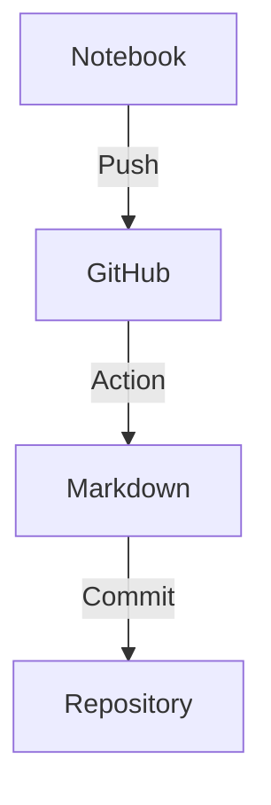

# GitHub Actions Jupyter to Markdown Workflow Setup

## Overview
This workflow automatically converts Jupyter notebooks to markdown files whenever you push changes, preserving mermaid diagrams for GitHub rendering.

## Workflow Configuration

### 1. Create Workflow File
Create `.github/workflows/mermaid.yml`:

```yaml
name: Convert Notebooks
on:
  push:
    paths: ['**.ipynb']
jobs:
  convert:
    runs-on: ubuntu-latest
    permissions:
      contents: write
    steps:
      - uses: actions/checkout@v3
      
      - name: Set up Python
        uses: actions/setup-python@v4
        with:
          python-version: '3.x'
      
      - name: Install jupyter
        run: pip install jupyter
      
      - name: Convert notebooks to markdown
        run: |
          find . -name "*.ipynb" -exec jupyter nbconvert --to markdown {} \;
      
      - name: Commit files
        run: |
          git config --local user.email "action@github.com"
          git config --local user.name "GitHub Action"
          git add -A
          git commit -m "Convert notebooks to markdown" || echo "No changes to commit"
          git push
```

### Key Features:
- **Triggers on:** Any `.ipynb` file change
- **Permissions:** Write access to commit back
- **Finds notebooks:** In any directory with `find`
- **Auto-commits:** Generated `.md` files

## Local Git Configuration

### 1. Set Default Merge Strategy
Prevent rebase conflicts when pulling remote changes:
```bash
git config pull.rebase false
```

### 2. Create Sync Alias
Streamline push/pull workflow:
```bash
git config --global alias.sync '!git pull && git push'
```

## Workflow Process

1. **You push** notebook changes
2. **GitHub Actions** converts to markdown
3. **Action commits** .md files to remote
4. **You pull** to get the .md files locally

## Usage

### First Time Setup
```bash
# Configure git
git config pull.rebase false
git config --global alias.sync '!git pull && git push'

# Push your notebooks
git add notebooks/*.ipynb
git commit -m "Add notebooks"
git push
```

### Daily Workflow
```bash
# Make notebook changes
git add notebooks/*.ipynb
git commit -m "Update analysis"
git sync  # Pulls remote .md files, then pushes
```

## Common Issues & Solutions

### "Updates were rejected"
Remote has .md files you don't have locally.
```bash
git pull origin your-branch
git push
# Or just use: git sync
```

### Notebooks in Subdirectories
The workflow uses `find . -name "*.ipynb"` to locate notebooks anywhere in the repository.

### Custom Email/Name
Update the workflow commit section:
```yaml
git config --local user.email "your-email@example.com"
git config --local user.name "Your Name"
```

## Mermaid Diagram Support

Notebooks with mermaid blocks:
````markdown

````

Convert properly and render on GitHub.

## Integration with TOC Generator

This workflow complements the TOC generator:
1. Generate TOC locally with script
2. Push notebook with TOC
3. GitHub converts to markdown
4. TOC links work in GitHub markdown

## Repository Structure
```
project/
├── .github/
│   └── workflows/
│       └── mermaid.yml
├── notebooks/
│   ├── analysis.ipynb
│   └── analysis.md (auto-generated)
└── scripts/
    └── generate_toc.py
```

## Best Practices

1. **Always sync** after pushing notebooks: `git sync`
2. **Commit notebooks** before their generated .md files
3. **Use descriptive** commit messages for notebooks
4. **Keep workflow simple** - avoid complex transformations