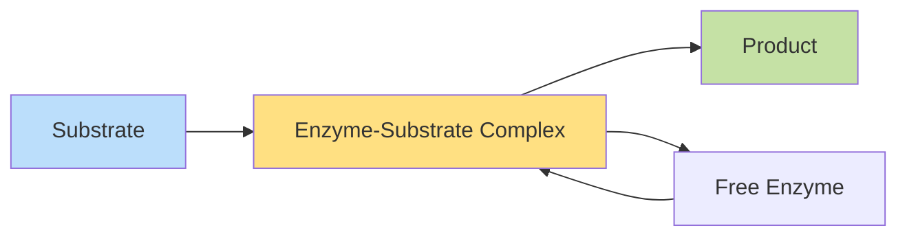

## Enzyme Kinetics: Michaelis-Menten Model

The relationship between substrate concentration and reaction velocity follows hyperbolic kinetics, where Vmax represents the maximum reaction rate and Km indicates substrate concentration at half-maximal velocity.



### Conclusion

Kinetic parameters determined: Km = 2.4 ± 0.3 mM, Vmax = 156 ± 8 μmol/min/mg. These values indicate high substrate affinity consistent with physiological function.


```python

```
