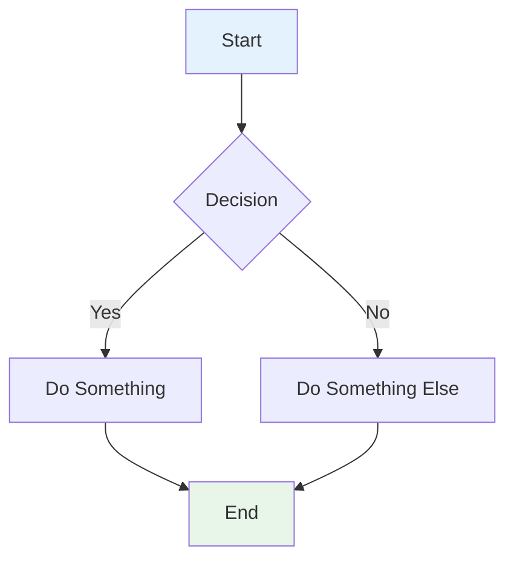
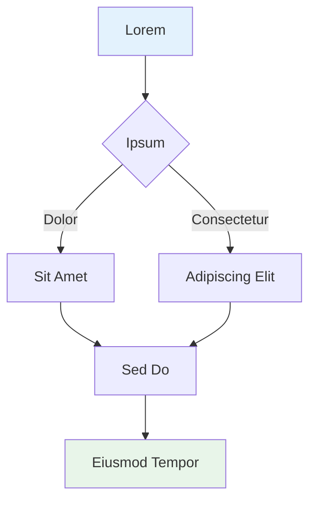
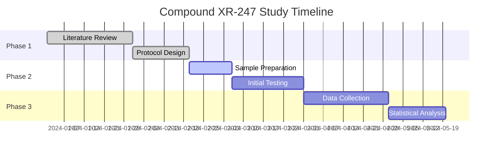
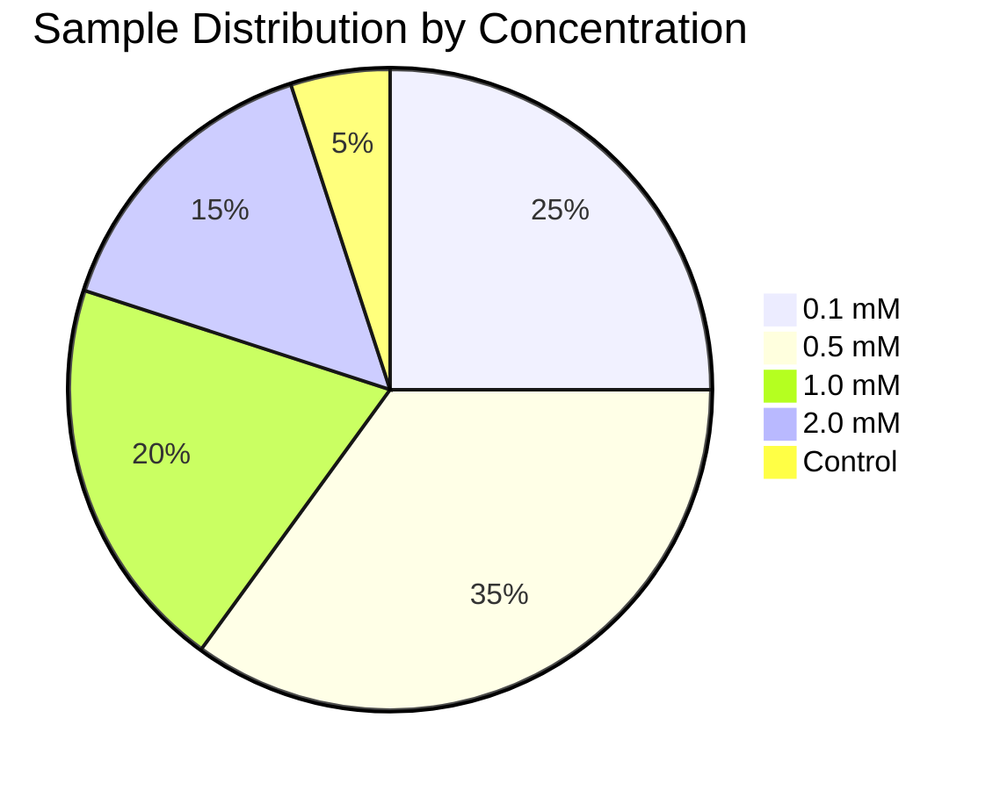
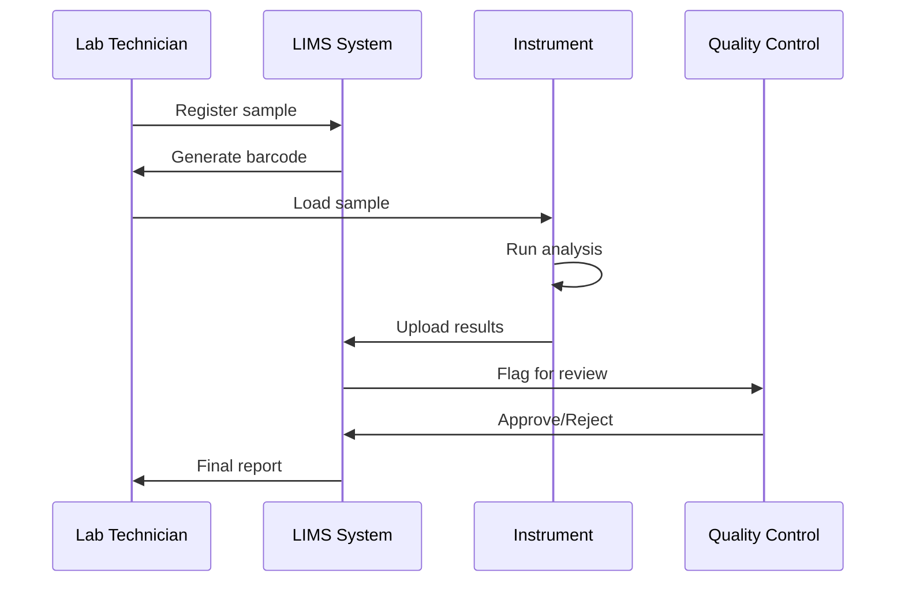
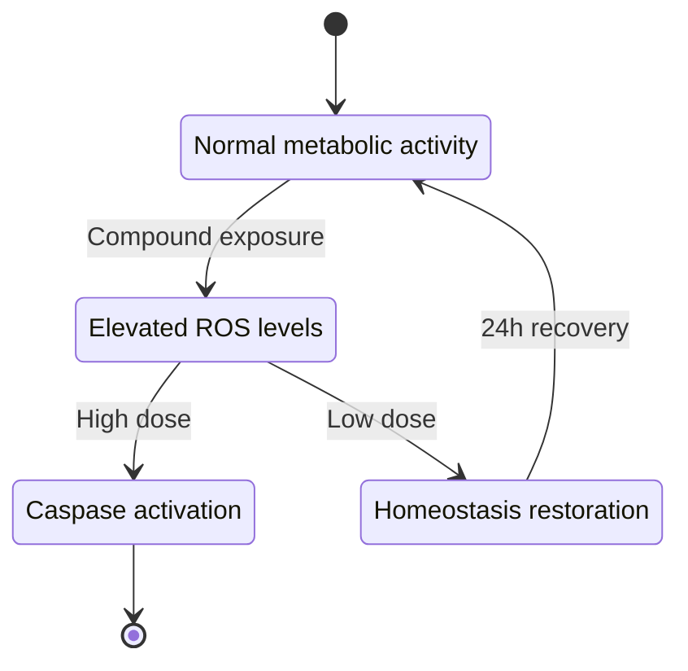
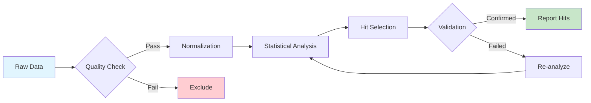
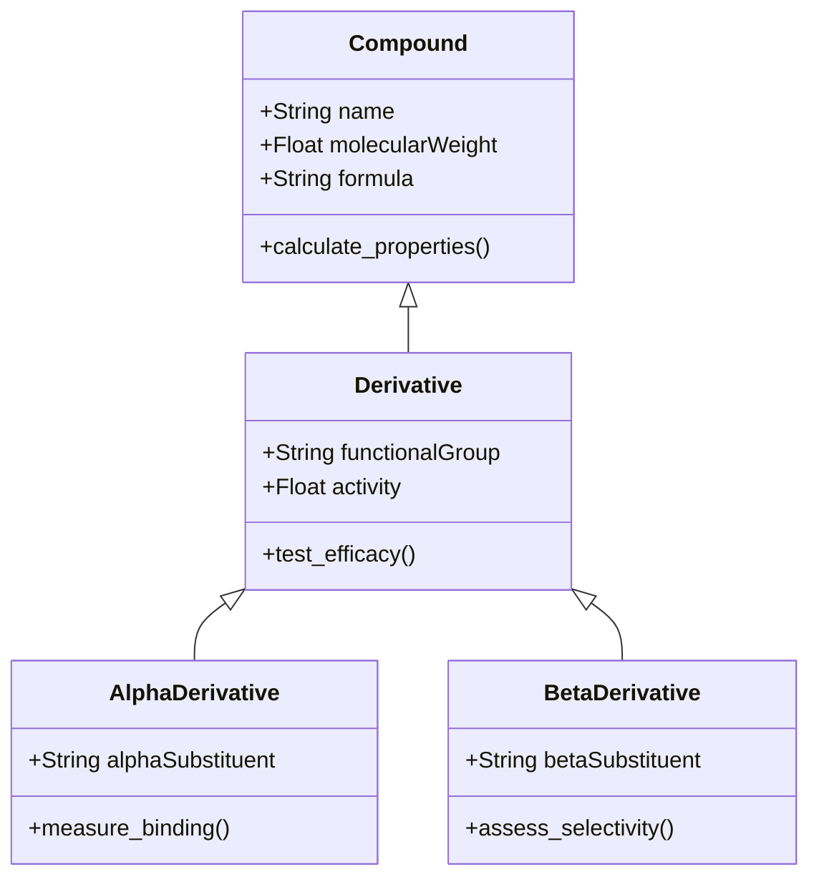

# Test Mermaid Conversion

Lorem ipsum dolor sit amet, consectetur adipiscing elit.

## Section 1: Before Mermaid

Lorem ipsum dolor sit amet, consectetur adipiscing elit, sed do eiusmod tempor incididunt ut labore et dolore magna aliqua.

### Section 2: After Mermaid

Ut enim ad minim veniam, quis nostrud exercitation ullamco laboris nisi ut aliquip ex ea commodo consequat.

# Test Notebook 2 - Additional Mermaid Test

Lorem ipsum dolor sit amet, consectetur adipiscing elit.

## New Section Before Diagram

Sed ut perspiciatis unde omnis iste natus error sit voluptatem accusantium doloremque laudantium.

### New Section After Diagram

Duis aute irure dolor in reprehenderit in voluptate velit esse cillum dolore eu fugiat nulla pariatur.

# Scientific Research Notebook - Data Analysis Pipeline

This notebook documents the experimental methodology and results for compound XR-247 efficacy analysis.

## 1. Experimental Timeline

Project timeline showing key phases of the research study from initial setup through final analysis.

## 2. Sample Distribution Analysis

Distribution of test samples across different experimental conditions showing concentration ranges.

## 3. Laboratory Protocol Sequence

Standard operating procedure for compound preparation and testing workflow.

## 4. Cell State Transitions

Cellular response states observed during compound exposure over 72-hour period.

## 5. Data Processing Pipeline

Computational workflow for analyzing high-throughput screening results.

## 6. Molecular Structure Classification

Hierarchical classification of compound derivatives based on functional groups.

