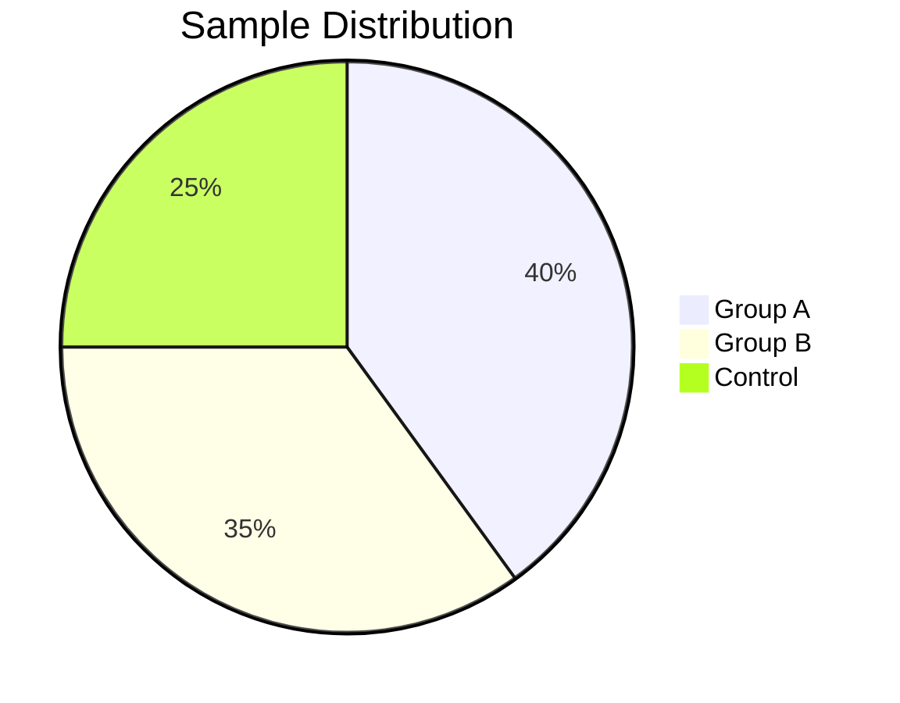
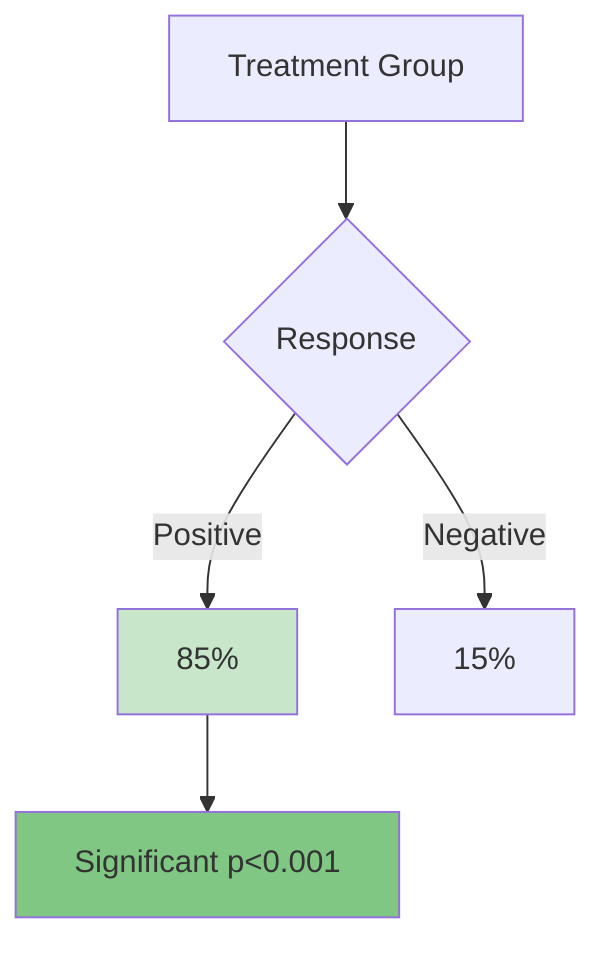
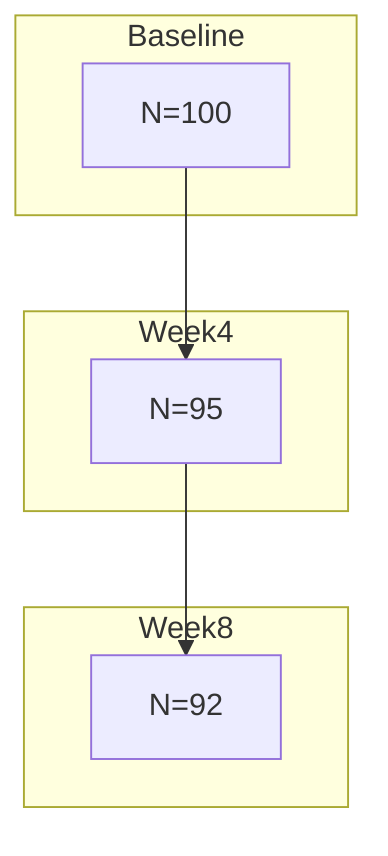
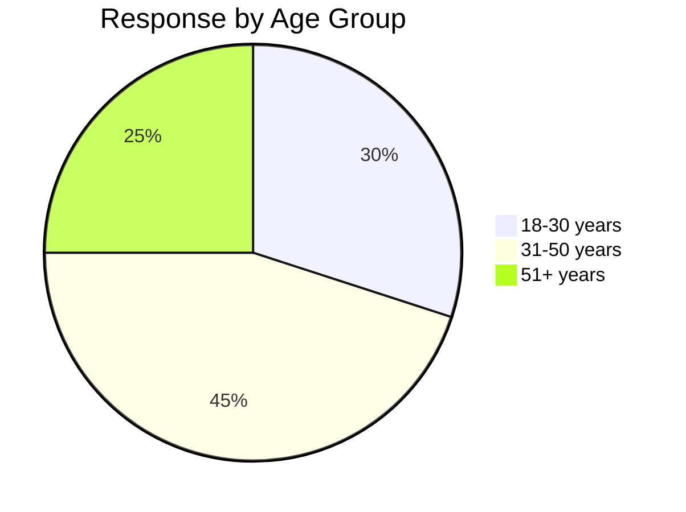
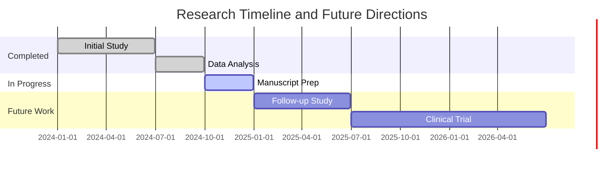
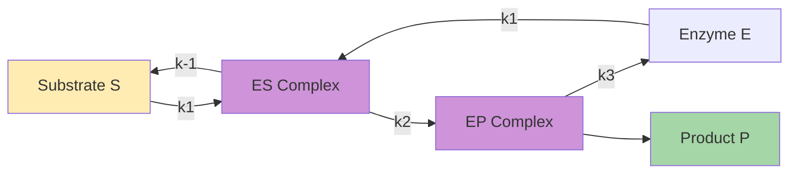

<!-- TOC -->
# Table of Contents

- [Introduction](#introduction)
- [Methods](#methods)
  - [Data Collection](#data-collection)
- [Methods](#methods)
  - [Data Collection](#data-collection)
  - [Statistical Analysis](#statistical-analysis)
- [Results](#results)
  - [Primary Outcomes](#primary-outcomes)
  - [Secondary Analysis](#secondary-analysis)
    - [Subgroup Analysis](#subgroup-analysis)
- [Conclusion](#conclusion)
- [Enzyme Kinetics Analysis](#enzyme-kinetics-analysis)

<!-- /TOC -->


# Test Notebook for TOC Generation

This notebook tests automatic table of contents generation.

```mermaid
graph TD
    A[Start] --> B[Generate TOC]
    B --> C[Parse Headers]
    C --> D[Create Links]
    D --> E[Insert TOC]
    
    style A fill:#e3f2fd
    style E fill:#c8e6c9

## Introduction

Basic introduction section.

```mermaid
flowchart LR
    A[Raw Data] --> B[Processing]
    B --> C[Analysis]
    C --> D[Results]
    
    style A fill:#fff3e0
    style D fill:#e8f5e9

## Methods

### Data Collection

Details about data collection.

```mermaid
sequenceDiagram
    participant User
    participant System
    participant Database
    
    User->>System: Submit data
    System->>Database: Store
    Database-->>System: Confirm
    System-->>User: Success

## Methods

### Data Collection

Details about data collection.

```mermaid
sequenceDiagram
    participant User
    participant System
    participant Database
    
    User->>System: Submit data
    System->>Database: Store
    Database-->>System: Confirm
    System-->>User: Success
```

### Statistical Analysis

Analysis methodology.



## Results

### Primary Outcomes

Main findings.



### Secondary Analysis

Additional results.



#### Subgroup Analysis

Detailed breakdown.



## Conclusion

Summary and future work.



## Enzyme Kinetics Analysis

Michaelis-Menten kinetics describe the rate of enzymatic reactions by relating reaction velocity to substrate concentration.



The steady-state assumption yields: v = (Vmax[S])/(Km + [S]) where Km = (k-1 + k2)/k1


